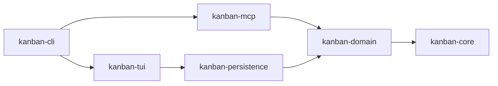

## Overview

Kanban is a **terminal-based kanban/project management tool** written in **Rust**, inspired by lazygit's interface design. It follows **SOLID principles** with a clean, modular architecture using Cargo workspaces.

## Tech Stack

<CardGroup cols={2}>
  <Card title="Language" icon="rust">
    Rust 2021 edition with full type safety
  </Card>
  <Card title="TUI Framework" icon="terminal">
    ratatui + crossterm for terminal rendering
  </Card>
  <Card title="Async Runtime" icon="bolt">
    Tokio for asynchronous operations
  </Card>
  <Card title="Development" icon="box">
    Nix for reproducible builds
  </Card>
</CardGroup>

## Workspace Structure

The project uses a Cargo workspace with six specialized crates:

```
crates/
├── kanban-core/        # Core traits, errors, and result types
├── kanban-domain/      # Domain models (Board, Card, Column, Tag)
├── kanban-persistence/ # JSON storage, versioning & migrations
├── kanban-tui/         # Terminal UI with ratatui
├── kanban-cli/         # CLI entry point
└── kanban-mcp/         # Model Context Protocol server
```

### Dependency Flow

The architecture respects the **dependency inversion principle**:



All layers depend on abstractions (traits), not concrete implementations.

## Crate Descriptions

### kanban-core

<Card title="Foundation Crate" icon="cube">
  Shared abstractions and utilities used across all other crates
</Card>

**Key Exports**:
- `KanbanError` - Centralized error types using `thiserror`
- `KanbanResult<T>` - Standard result type alias
- `Graph<N, E>` - Generic graph data structure for dependencies
- `InputState` - Text input handling
- `AppConfig` - Application configuration
- `SelectionState` - UI selection management
- `Editable` - Trait for editable entities

**Design Patterns**:
- Error handling with `thiserror`
- Async traits with `async-trait`
- Type-safe graph operations

```rust
// Example: Core error handling
pub type KanbanResult<T> = Result<T, KanbanError>;

#[derive(Debug, thiserror::Error)]
pub enum KanbanError {
    #[error("IO error: {0}")]
    Io(#[from] std::io::Error),
    // ... more variants
}
```

### kanban-domain

<Card title="Business Logic" icon="briefcase">
  Pure domain models with no infrastructure dependencies
</Card>

**Core Models**:
- `Board` - Top-level kanban board with columns and metadata
- `Column` - Board columns with WIP limits and ordering
- `Card` - Task cards with priority, status, due dates, story points
- `Tag` - Categorization tags
- `Sprint` - Sprint planning and tracking
- `ArchivedCard` - Historical card data

**Key Features**:
- Rich domain models with behavior methods
- Command pattern for state mutations
- Card dependency graph with blocking relationships
- Search and filtering capabilities
- Export/import functionality
- History management for undo/redo

```rust
// Example: Domain model with behavior
pub struct Card {
    pub id: CardId,
    pub column_id: ColumnId,
    pub title: String,
    pub priority: CardPriority,
    pub status: CardStatus,
    pub story_points: Option<u8>,
    pub due_date: Option<NaiveDate>,
    pub created_at: DateTime<Utc>,
    pub updated_at: DateTime<Utc>,
}

impl Card {
    pub fn update_status(&mut self, status: CardStatus) {
        self.status = status;
        self.updated_at = Utc::now();
    }
}
```

**Design Pattern**: Rich domain models with behavior, leveraging Rust's type system for compile-time guarantees.

### kanban-persistence

<Card title="Data Layer" icon="database">
  Progressive auto-save with conflict detection
</Card>

**Features**:
- **Progressive Auto-Save**: Changes saved immediately after each operation
- **Async Processing**: Commands queued via bounded channel, processed by background worker
- **Conflict Detection**: Multi-instance changes detected via file metadata
- **Format Versioning**: Automatic V1→V2 migration with backup creation
- **Atomic Writes**: Crash-safe pattern (temp file → atomic rename)
- **Own-Write Detection**: Metadata-based filtering prevents false positives

**Technologies**:
- `notify` for file watching
- `tempfile` for atomic writes
- `serde_json` for serialization

### kanban-tui

<Card title="User Interface" icon="window-maximize">
  Event-driven terminal UI with ratatui
</Card>

**Module Structure**:
- `app` - Application state and main event loop
- `ui` - Rendering components using ratatui widgets
- `events` - Keyboard and terminal event handling
- `input` - Input state management
- `dialog` - Dialog interaction patterns
- `editor` - External editor integration

**Features**:
- Vim-like keyboard navigation (hjkl)
- Multiple view modes (board, list, task list)
- Context-aware shortcuts
- Modal dialogs for input
- External editor support
- Clipboard integration with `arboard`
- Markdown rendering with `pulldown-cmark`

**Design Pattern**: Event-driven architecture with component-based rendering inspired by lazygit.

### kanban-cli

<Card title="CLI Entry Point" icon="terminal">
  Command-line interface using clap
</Card>

**Responsibilities**:
- Command parsing with `clap`
- Subcommand handlers (board, card, column, sprint, export)
- Tracing/logging initialization
- TUI coordination
- Shell completion generation

**Commands**:
```bash
kanban                    # Launch TUI
kanban board list         # List boards
kanban card create        # Create card
kanban export             # Export data
```

### kanban-mcp

<Card title="MCP Server" icon="server">
  Model Context Protocol integration for LLMs
</Card>

**Features**:
- Full read/write access to boards, cards, columns, sprints
- JSON-RPC over stdio using `rmcp` SDK
- Resource and tool endpoints
- Schema validation with `schemars`

**Use Case**: Enables LLM tools (Claude Code, Cursor) to interact with kanban boards programmatically.

## SOLID Principles

The architecture strictly follows SOLID principles:

<AccordionGroup>
  <Accordion title="Single Responsibility Principle">
    Each crate has one clear purpose:
    - `kanban-core`: Foundation utilities
    - `kanban-domain`: Business logic
    - `kanban-persistence`: Data storage
    - `kanban-tui`: User interface
    - `kanban-cli`: Command-line interface
    - `kanban-mcp`: Protocol server
  </Accordion>

  <Accordion title="Open/Closed Principle">
    Domain models are extensible through methods without modifying existing code. New features add behavior without breaking existing functionality.
  </Accordion>

  <Accordion title="Liskov Substitution Principle">
    Types are consistent and predictable. All implementations of traits can be substituted without breaking behavior.
  </Accordion>

  <Accordion title="Interface Segregation Principle">
    Traits are minimal and focused (e.g., `Editable`, `GraphNode`). No client is forced to depend on methods it doesn't use.
  </Accordion>

  <Accordion title="Dependency Inversion Principle">
    All layers depend on abstractions (traits), not concrete implementations. Higher-level modules don't depend on lower-level modules directly.
  </Accordion>
</AccordionGroup>

## Design Patterns

### Command Pattern

All state mutations use the **command pattern** for undo/redo support:

```rust
pub trait Command {
    fn execute(&mut self, ctx: &mut CommandContext) -> KanbanResult<()>;
    fn description(&self) -> String;
}

// Example: Create card command
pub struct CreateCard {
    pub board_id: BoardId,
    pub column_id: ColumnId,
    pub title: String,
    pub priority: CardPriority,
}

impl Command for CreateCard {
    fn execute(&mut self, ctx: &mut CommandContext) -> KanbanResult<()> {
        let card = Card::new(
            self.column_id,
            self.title.clone(),
            /* ... */
        );
        ctx.cards.push(card);
        Ok(())
    }
}
```

**Flow**:
1. **Event Handler** (TUI): Processes keyboard input
2. **Command**: Encapsulates the mutation
3. **StateManager**: Executes command via `CommandContext`
4. **Dirty Flag**: Marks state as dirty
5. **Progressive Save**: Auto-saves via async channel

### Repository Pattern

Persistence layer abstracts data access:

```rust
// Async file operations
pub struct FileRepository {
    path: PathBuf,
}

impl FileRepository {
    pub async fn save(&self, data: &AllBoardsExport) -> KanbanResult<()> {
        // Atomic write: temp file → rename
    }

    pub async fn load(&self) -> KanbanResult<AllBoardsExport> {
        // Load and migrate versions
    }
}
```

### Observer Pattern

File watching for multi-instance conflict detection:

```rust
use notify::{Watcher, RecursiveMode};

let (tx, rx) = channel();
let mut watcher = notify::watcher(tx, Duration::from_secs(1))?;
watcher.watch(&data_file, RecursiveMode::NonRecursive)?;

// React to external changes
while let Ok(event) = rx.recv() {
    handle_file_change(event);
}
```

## Inspirations from lazygit

The TUI design follows lazygit's proven patterns:

<CardGroup cols={2}>
  <Card title="Keyboard-Driven" icon="keyboard">
    Vim-like navigation with hjkl and modal interfaces
  </Card>
  <Card title="Panel-Based Layout" icon="table-columns">
    Multiple views (boards, columns, cards) with clear focus
  </Card>
  <Card title="Contextual Commands" icon="circle-question">
    Bottom panel shows available shortcuts for current context
  </Card>
  <Card title="Fast Navigation" icon="bolt">
    Quick jumps, search, and efficient workflows
  </Card>
</CardGroup>

## Type Safety

Leverage Rust's type system for correctness:

```rust
// Newtype pattern for IDs
pub struct BoardId(Uuid);
pub struct CardId(Uuid);
pub struct ColumnId(Uuid);

// Enums for state machines
pub enum CardStatus {
    Todo,
    InProgress,
    Done,
}

pub enum CardPriority {
    Low,
    Medium,
    High,
    Critical,
}

// Type-safe builders
let card = Card::new(column_id, "Task".to_string(), 0)
    .with_priority(CardPriority::High)
    .with_story_points(5);
```

<Note>
  The newtype pattern prevents mixing IDs of different entity types at compile time.
</Note>

## Error Handling Strategy

<Steps>
  <Step title="Core Layer">
    Define errors with `thiserror` in `kanban-core`:
    ```rust
    #[derive(Debug, thiserror::Error)]
    pub enum KanbanError {
        #[error("Card not found: {0}")]
        CardNotFound(CardId),
    }
    ```
  </Step>
  
  <Step title="Domain Layer">
    All public APIs return `KanbanResult<T>` with context
  </Step>
  
  <Step title="Application Layer">
    Use `anyhow` in `kanban-cli` for error reporting:
    ```rust
    fn main() -> anyhow::Result<()> {
        // Application logic
    }
    ```
  </Step>
  
  <Step title="UI Layer">
    Log errors with `tracing::error!` and show user-friendly messages
  </Step>
</Steps>

## Performance Considerations

- **Minimal Allocations**: Use `&str` over `String` where possible
- **Async I/O**: Tokio for non-blocking file operations
- **Efficient Rendering**: Only redraw changed UI components
- **Lazy Loading**: Load boards on-demand
- **Release Profile**: LTO, single codegen unit, strip symbols

```toml
[profile.release]
opt-level = 3
lto = true
codegen-units = 1
strip = true
```

## Next Steps

<CardGroup cols={2}>
  <Card title="Contributing" icon="code-pull-request" href="/development/contributing">
    Learn how to contribute to the codebase
  </Card>
  <Card title="Domain Models" icon="cube">
    Explore domain models in depth (coming soon)
  </Card>
</CardGroup>