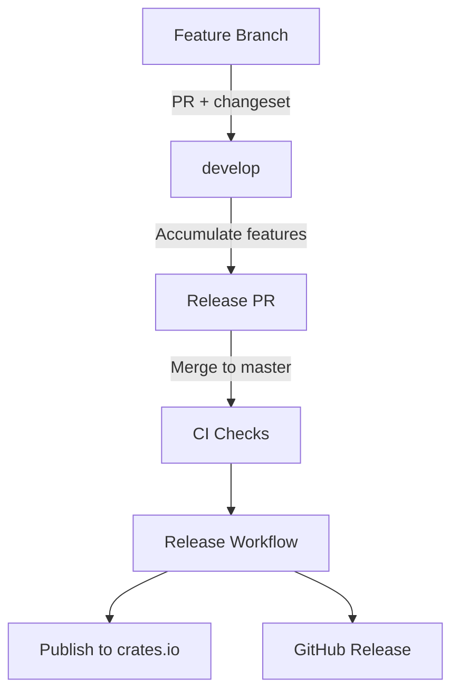

Thank you for considering contributing to Kanban! This guide will help you get started with development.

## Development Setup

### Prerequisites

<CardGroup cols={2}>
  <Card title="Rust 1.70+" icon="rust">
    Install via [rustup](https://rustup.rs)
  </Card>
  <Card title="Nix (Recommended)" icon="box">
    For reproducible environment
  </Card>
</CardGroup>

### Getting Started

<Steps>
  <Step title="Clone the repository">
    ```bash
    git clone https://github.com/fulsomenko/kanban
    cd kanban
    ```
  </Step>

  <Step title="Enter development shell">
    **Using Nix (recommended)**:
    ```bash
    nix develop
    ```
    
    This provides:
    - Rust toolchain (stable, rust-analyzer, rust-src)
    - cargo-watch, cargo-edit, cargo-audit, cargo-tarpaulin
    - bacon (background compiler)
    
    **Or install dependencies manually**:
    ```bash
    rustup update stable
    ```
  </Step>

  <Step title="Build the project">
    ```bash
    cargo build
    ```
  </Step>

  <Step title="Run the application">
    ```bash
    cargo run
    ```
  </Step>
</Steps>

## Common Commands

### Building

<CodeGroup>
```bash Debug Build
cargo build            # Build all crates
```

```bash Release Build
cargo build --release  # Optimized production build
```

```bash Nix Build
nix build              # Build with Nix (reproducible)
```
</CodeGroup>

### Running

<CodeGroup>
```bash TUI
cargo run              # Launch TUI
cargo run -- tui       # Explicit TUI mode
```

```bash With Import
cargo run -- test-board.json    # Load board from file
```

```bash Initialize
cargo run -- init --name "My Board"  # Initialize new board
```
</CodeGroup>

### Development Tools

<Tabs>
  <Tab title="Auto-reload">
    ```bash
    cargo watch -x run     # Auto-rebuild on file changes
    ```
  </Tab>
  
  <Tab title="Background Compiler">
    ```bash
    bacon                  # Continuous compilation with diagnostics
    ```
  </Tab>
  
  <Tab title="Fast Check">
    ```bash
    cargo check            # Fast compilation check (no binary)
    ```
  </Tab>
  
  <Tab title="Linting">
    ```bash
    cargo clippy           # Rust linter
    cargo clippy --all-targets --all-features -- -D warnings
    ```
  </Tab>
  
  <Tab title="Formatting">
    ```bash
    cargo fmt              # Format code
    cargo fmt --all        # Format entire workspace
    ```
  </Tab>
</Tabs>

### Testing

<CodeGroup>
```bash All Tests
cargo test             # Run all tests
```

```bash Specific Crate
cargo test --package kanban-domain
```

```bash With Output
cargo test -- --nocapture
```

```bash Coverage
cargo tarpaulin        # Code coverage report
```
</CodeGroup>

## Code Style Guidelines

### Rust Best Practices

<AccordionGroup>
  <Accordion title="Function Parameters">
    Prefer `&str` over `String` for function parameters:
    ```rust
    // Good
    fn process_title(title: &str) -> String
    
    // Avoid
    fn process_title(title: String) -> String
    ```
  </Accordion>

  <Accordion title="Return Types">
    Use `impl Trait` for return types when appropriate:
    ```rust
    fn get_cards() -> impl Iterator<Item = Card>
    ```
  </Accordion>

  <Accordion title="Error Handling">
    Use `Result<T, E>` for recoverable errors, `panic!` only for unrecoverable:
    ```rust
    pub fn find_card(&self, id: CardId) -> KanbanResult<&Card> {
        self.cards.iter()
            .find(|c| c.id == id)
            .ok_or(KanbanError::CardNotFound(id))
    }
    ```
  </Accordion>

  <Accordion title="Function Size">
    Keep functions small and focused (< 50 lines):
    ```rust
    // Good: focused function
    fn validate_card_title(title: &str) -> KanbanResult<()> {
        if title.is_empty() {
            return Err(KanbanError::InvalidInput("Title cannot be empty"));
        }
        Ok(())
    }
    ```
  </Accordion>
</AccordionGroup>

### Project-Specific Conventions

<Warning>
  **NO COMMENTS** unless:
  - Documenting public APIs
  - Explaining complex algorithms
  - Required for safety/correctness
  
  Let the code speak for itself through clear naming and structure.
</Warning>

**Module Organization**:
- Each file should be < 300 lines
- Extract reusable patterns into separate modules
- Follow existing module structure:
  - `app.rs` - Application state and event handling
  - `ui.rs` - Rendering logic
  - `events.rs` - Event loop and input handling
  - `input.rs` - Input state management
  - `dialog.rs` - Dialog interaction patterns
  - `editor.rs` - External editor integration

**Type Safety**:
```rust
// Leverage newtype pattern
pub struct BoardId(Uuid);
pub struct CardId(Uuid);
pub struct ColumnId(Uuid);

// Use enums for state machines
pub enum AppMode {
    Normal,
    CreateCard,
    EditCard,
}

pub enum Focus {
    BoardList,
    CardList,
    CardDetail,
}
```

**Error Handling**:
- All public APIs return `KanbanResult<T>`
- Use `thiserror` for error definitions
- Provide context in error messages
- Log errors with `tracing::error!`

```rust
use tracing::error;

if let Err(e) = self.execute_command(cmd) {
    error!("Failed to create card: {}", e);
    self.show_error_dialog("Failed to create card");
    return;
}
```

**Immutability**:
```rust
// Prefer immutable data
let card = Card::new(column_id, title, position);

// Use &mut only when necessary
impl Card {
    pub fn update_title(&mut self, title: String) {
        self.title = title;
        self.updated_at = Utc::now();  // Update timestamp on mutation
    }
}
```

## Architecture Principles

See the [Architecture](/development/architecture) page for detailed information on:
- SOLID principles applied to this codebase
- Workspace structure and dependency flow
- Design patterns (Command, Repository, Observer)
- Crate descriptions and responsibilities

## Development Workflow

### Domain-First Approach

<Steps>
  <Step title="Define Domain Model">
    Start in `kanban-domain`:
    ```rust
    // crates/kanban-domain/src/card.rs
    pub struct Card {
        pub id: CardId,
        pub title: String,
        pub branch_name: Option<String>,  // New field
        // ...
    }
    ```
  </Step>

  <Step title="Implement Behavior">
    Add methods to domain models:
    ```rust
    impl Card {
        pub fn update_branch_name(&mut self, branch_name: Option<String>) {
            self.branch_name = branch_name;
            self.updated_at = Utc::now();
        }
    }
    ```
  </Step>

  <Step title="Create Command">
    Implement command in `kanban-domain/src/commands/`:
    ```rust
    pub struct UpdateCardBranch {
        pub card_id: CardId,
        pub branch_name: Option<String>,
    }

    impl Command for UpdateCardBranch {
        fn execute(&mut self, ctx: &mut CommandContext) -> KanbanResult<()> {
            let card = ctx.find_card_mut(self.card_id)?;
            card.update_branch_name(self.branch_name.clone());
            Ok(())
        }
    }
    ```
  </Step>

  <Step title="Update Application State">
    Add handler in `kanban-tui/src/app.rs`:
    ```rust
    pub fn handle_update_branch(&mut self) {
        let (card_id, branch_name) = { /* collect data */ };
        
        let cmd = Box::new(UpdateCardBranch {
            card_id,
            branch_name,
        });
        
        if let Err(e) = self.execute_command(cmd) {
            tracing::error!("Failed to update branch: {}", e);
        }
    }
    ```
  </Step>

  <Step title="Implement UI">
    Add rendering in `kanban-tui/src/ui.rs`:
    ```rust
    fn render_card_branch(f: &mut Frame, card: &Card, area: Rect) {
        if let Some(branch) = &card.branch_name {
            let text = format!("Branch: {}", branch);
            let paragraph = Paragraph::new(text);
            f.render_widget(paragraph, area);
        }
    }
    ```
  </Step>

  <Step title="Wire Up Events">
    Add keyboard shortcut:
    ```rust
    KeyCode::Char('b') => self.handle_update_branch(),
    ```
    
    Update help text in footer.
  </Step>
</Steps>

### State Management & Persistence

The application uses a **command pattern** for all state mutations:

**Flow**:
1. **Event Handler** (kanban-tui): Processes keyboard input
2. **Command** (kanban-domain): Encapsulates mutation
3. **StateManager** (kanban-tui): Executes command via `CommandContext`
4. **CommandContext**: Applies mutation to data vectors
5. **Dirty Flag**: StateManager marks state as dirty
6. **Progressive Save**: Auto-saves immediately via async channel

**Example Pattern**:
```rust
pub fn handle_create_card_key(&mut self) {
    // Collect immutable data before command execution
    let (board_id, column_id) = {
        let Some(board) = self.get_active_board() else { return };
        let Some(column) = board.columns.get(self.column_index) else { return };
        (board.id, column.id)
    };

    // Create command
    let cmd = Box::new(CreateCard {
        board_id,
        column_id,
        title: self.input.as_str().to_string(),
        priority: CardPriority::Medium,
    });

    // Execute (sets dirty flag automatically)
    if let Err(e) = self.execute_command(cmd) {
        tracing::error!("Failed to create card: {}", e);
        return;
    }
    
    // StateManager handles persistence automatically
}
```

**Persistence Features**:
- **Progressive Auto-Save**: Changes saved immediately after each operation
- **Conflict Detection**: Multi-instance changes detected via file metadata
- **Format Versioning**: Automatic V1→V2 migration with backup creation
- **Atomic Writes**: Crash-safe pattern prevents corruption

<Note>
  StateManager handles dirty flags and persistence automatically. You just execute commands!
</Note>

## Testing

### Writing Tests

<Tabs>
  <Tab title="Unit Tests">
    Tests go in the same file as implementation:
    ```rust
    #[cfg(test)]
    mod tests {
        use super::*;

        #[test]
        fn test_card_completion_toggle() {
            let mut card = Card::new(
                column_id,
                "Test".to_string(),
                0
            );
            assert_eq!(card.status, CardStatus::Todo);

            card.update_status(CardStatus::Done);
            assert_eq!(card.status, CardStatus::Done);
        }
    }
    ```
  </Tab>
  
  <Tab title="Integration Tests">
    Tests in `tests/` directory:
    ```rust
    // tests/board_operations.rs
    use kanban_domain::*;

    #[test]
    fn test_board_export_import() {
        let board = Board::new("Test Board".to_string());
        let export = BoardExporter::export(&board);
        let imported = BoardImporter::import(&export).unwrap();
        assert_eq!(board.id, imported.id);
    }
    ```
  </Tab>
  
  <Tab title="Guidelines">
    - Test domain logic independently
    - Use descriptive test names: `test_card_completion_toggle`
    - Test edge cases and error conditions
    - Keep tests focused and readable
    - No mocking in unit tests when possible
  </Tab>
</Tabs>

## Branching and Release Workflow

### Branch Strategy

**develop → master** release workflow:

<Steps>
  <Step title="Feature Development">
    Create feature branch from `develop`:
    ```bash
    git checkout develop
    git pull origin develop
    git checkout -b MVP-123/my-feature
    ```
  </Step>

  <Step title="Make Changes">
    Make small, atomic commits:
    ```bash
    git commit -m "feat: add sprint filtering"
    git commit -m "refactor: extract dialog logic"
    ```
  </Step>

  <Step title="Create Changeset">
    Before submitting PR:
    ```bash
    # Auto-generate from commits (default: patch)
    ./scripts/create-changeset.sh
    
    # Or specify bump type and description
    ./scripts/create-changeset.sh minor "Add sprint support"
    ```
  </Step>

  <Step title="Submit PR">
    Create PR to `develop`:
    - PR checks for changeset presence
    - Changesets accumulate in `develop`
  </Step>

  <Step title="Periodic Release">
    From `develop` → `master`:
    - All accumulated changesets consumed
    - Single version bump (highest precedence)
    - Automatic publish to crates.io
    - GitHub release created
  </Step>
</Steps>

### Commit Messages

Use **semantic commit format**:

```
<type>: <description>

[optional body]
```

**Types**:
- `feat`: New feature
- `fix`: Bug fix
- `docs`: Documentation changes
- `refactor`: Code refactoring
- `test`: Adding/updating tests
- `chore`: Maintenance tasks
- `ci`: CI/CD changes

**Examples**:
```bash
feat: add sprint filtering to task view
fix: handle empty board state correctly
docs: update keyboard shortcuts in README
refactor: extract dialog rendering logic
```

<Tip>
  Make **small, atomic commits** that contain one functionally related change. Each commit should compile and pass tests.
</Tip>

**Good commit strategy**:
```bash
✅ refactor: add handlers module
✅ refactor: extract navigation handlers
✅ refactor: extract board handlers
✅ refactor: simplify handle_key_event to use handlers
```

**Bad commit strategy**:
```bash
❌ refactor: extract all handlers and simplify app.rs (too large)
❌ fix: fix bugs (vague, multiple unrelated fixes)
```

### Monorepo Versioning

<Warning>
  All crates in this workspace maintain **synchronized versions**.
</Warning>

- Root `Cargo.toml` defines workspace version: `version = "X.Y.Z"`
- All crates reference via `version.workspace = true`
- Cross-crate dependencies use path-only: `{ path = "../kanban-core" }` (no version)
- Prevents version skew during publishing

**Publishing Order**:
1. `kanban-core` (no internal dependencies)
2. `kanban-domain` (depends on kanban-core)
3. `kanban-persistence` (depends on kanban-domain)
4. `kanban-tui` (depends on kanban-persistence)
5. `kanban-cli` (depends on all others)
6. `kanban-mcp` (depends on kanban-domain)

### Release Validation

Before publishing, validate the release:

```bash
# Using Nix
nix run .#validate-release

# Or directly
bash scripts/validate-release.sh
```

**Checks**:
1. All crates use workspace versioning
2. No hardcoded versions in path dependencies
3. Entire workspace builds correctly
4. Dry-run publish for each crate
5. Dependency resolution validation

<Info>
  This runs automatically in CI on PRs to `develop` and `master`.
</Info>

## Pull Request Guidelines

### Before Submitting

<Tabs>
  <Tab title="Checklist">
    - [ ] Run `cargo fmt --all` to format code
    - [ ] Run `cargo clippy --all-targets --all-features -- -D warnings`
    - [ ] Run `cargo test` and ensure all tests pass
    - [ ] Test manually with `cargo run`
    - [ ] Create changeset with `./scripts/create-changeset.sh`
    - [ ] Update README.md if adding user-facing features
    - [ ] Update CLAUDE.md if changing architecture/conventions
  </Tab>
  
  <Tab title="Format">
    **PR Title**: `<branch-name>`
    
    **PR Description**:
    ```markdown
    Fixes task filtering behavior:
    
    - Add sprint filter toggle to task view
    - Update UI to show active sprint indicator
    - Fix filter persistence across sessions
    
    ## What
    Brief description of changes
    
    ## Why
    Motivation and context
    
    ## How
    Implementation approach
    
    ## Testing
    How you tested the changes
    ```
  </Tab>
</Tabs>

### Changesets

Create `.changeset/<descriptive-name>.md`:

```md
---
bump: patch
---

Description of changes

- List of changes
```

**Bump types**:
- `patch` - Bug fixes, small changes (0.1.0 → 0.1.1)
- `minor` - New features, backwards compatible (0.1.0 → 0.2.0)
- `major` - Breaking changes (0.1.0 → 1.0.0)

**On merge to master**:
- Version automatically bumps based on changeset
- CHANGELOG.md updates with your description
- New version publishes to crates.io
- GitHub release created with tag

## Code Review Process

<Steps>
  <Step title="Automated Checks">
    CI runs format, clippy, tests, and validation
  </Step>
  
  <Step title="Maintainer Review">
    Code review and feedback from maintainers
  </Step>
  
  <Step title="Address Feedback">
    Update PR based on review comments
  </Step>
  
  <Step title="Merge">
    Once approved, maintainer merges to `develop`
  </Step>
</Steps>

## Areas for Contribution

<CardGroup cols={2}>
  <Card title="UI Improvements" icon="palette">
    Enhance TUI rendering, add color themes, improve layouts
  </Card>
  <Card title="Features" icon="sparkles">
    New metadata fields, filtering options, search improvements
  </Card>
  <Card title="Testing" icon="vial">
    Increase test coverage, add integration tests
  </Card>
  <Card title="Documentation" icon="book">
    Improve docs, add examples, tutorials
  </Card>
  <Card title="Performance" icon="gauge-high">
    Optimize rendering, reduce allocations, profiling
  </Card>
  <Card title="Refactoring" icon="code">
    Extract patterns, improve modularity, simplify code
  </Card>
</CardGroup>

## CI/CD and GitHub Secrets

### Required Secrets

Configure these secrets in GitHub repository settings:

<AccordionGroup>
  <Accordion title="CARGO_REGISTRY_TOKEN">
    **Required for**: Publishing to crates.io
    
    **How to obtain**:
    1. Login to crates.io with GitHub account
    2. Go to Account Settings → API Tokens
    3. Create new token with "publish-update" scope
    4. Add to GitHub: Settings → Secrets → Actions → New repository secret
  </Accordion>

  <Accordion title="DEPLOY_KEY">
    **Required for**: Automated git commits and tag pushes
    
    **How to generate**:
    ```bash
    ssh-keygen -t ed25519 -C "github-actions@kanban" -f deploy_key -N ""
    ```
    
    - Add public key (deploy_key.pub) to GitHub: Settings → Deploy keys → Add (with write access)
    - Add private key (deploy_key) to GitHub: Settings → Secrets → Actions → New repository secret
  </Accordion>
</AccordionGroup>

### CI/CD Workflows

**ci.yml** - Runs on all pushes and PRs:
- Format check (`cargo fmt`)
- Linter (`cargo clippy`)
- Tests (`cargo test`)
- Build validation
- Changeset validation (PRs to develop)

**release.yml** - Runs on push to master:
- Checks for changesets (skips if none)
- Bumps version based on changesets
- Updates CHANGELOG.md
- Publishes to crates.io
- Creates GitHub release with tag



## Questions?

<CardGroup cols={3}>
  <Card title="Bug Reports" icon="bug" href="https://github.com/fulsomenko/kanban/issues">
    Open an issue for bugs
  </Card>
  <Card title="Feature Requests" icon="lightbulb" href="https://github.com/fulsomenko/kanban/issues">
    Suggest new features
  </Card>
  <Card title="Discussions" icon="comments" href="https://github.com/fulsomenko/kanban/discussions">
    Ask design questions
  </Card>
</CardGroup>

## License

By contributing, you agree that your contributions will be licensed under the **Apache 2.0 License**.

<Tip>
  Check existing issues and discussions before starting work to avoid duplication!
</Tip>